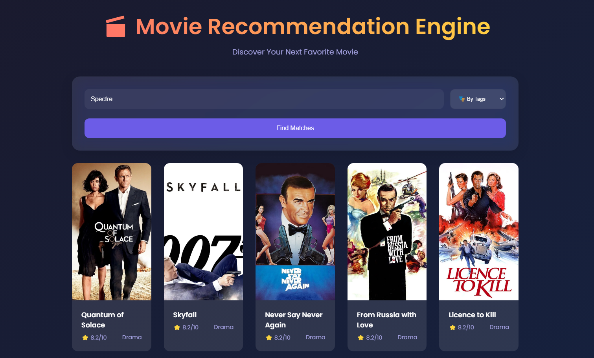
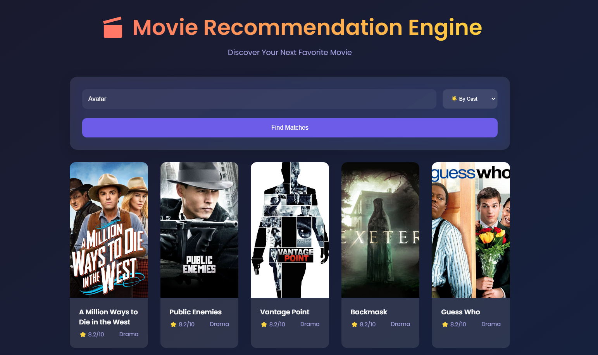

# Movie Recommender System

**Unlock Your Next Favorite Film!**
This NLP-powered Movie Recommendation Web App provides tailored suggestions based on cast, genres, tags, and production companies. Built with Python and Streamlit, it features a Dockerized deployment with monitoring via Prometheus/Grafana and orchestration via Airflow.

---

## Project Overview

The system uses a **Bag-of-Words approach** to compute movie similarity through NLP analysis of metadata. Key components include:

- **Personalized recommendations** using TMDB API integration
- Detailed movie profiles (description, cast, production details)
- Dockerized microservices architecture
- Performance monitoring and workflow orchestration

---

## Features

- **Recommendation Engine**: Content-based filtering using text vectorization
- **Monitoring Stack**:
  - Prometheus for metrics collection
  - Grafana dashboards tracking API success rates, system resources, and app latency
- **Orchestration**: Airflow pipelines for data tasks
- **Search Functionality**: Full-text movie title search

---

## Sample Application Screenshots




## Installation

```bash
docker-compose up --build
```

**Prerequisites**:

- Docker and Docker Compose installed
- TMDB API key (set in `.env` file):
  ```env
  TMDB_API_KEY=your_api_key_here
  ```

---

## Application Access

| Component  | URL                                         | Credentials       |
| ---------- | ------------------------------------------- | ----------------- |
| Movie App  | [http://localhost:5555](http://localhost:5555) | None              |
| Prometheus | [http://localhost:9090](http://localhost:9090) | None              |
| Grafana    | [http://localhost:3000](http://localhost:3000) | admin / admin     |
| Airflow    | [http://localhost:8080](http://localhost:8080) | airflow / airflow |

---

## Monitoring Metrics

Grafana dashboards display:

- TMDB API call success/failure rates
- Flask application response latency
- System resource utilization (CPU/RAM)
- Container health statuses

---

## Notes

- Initial startup may take 5-8 minutes for dataset initialization
- Regenerate TMDB API keys through [TMDB Portal](https://www.themoviedb.org/settings/api)
- Metrics endpoint available at [http://localhost:5555/metrics](http://localhost:5555/metrics)

This implementation demonstrates containerized deployment of machine learning systems with operational monitoring. The modular architecture allows easy scaling of recommendation components and monitoring features.
